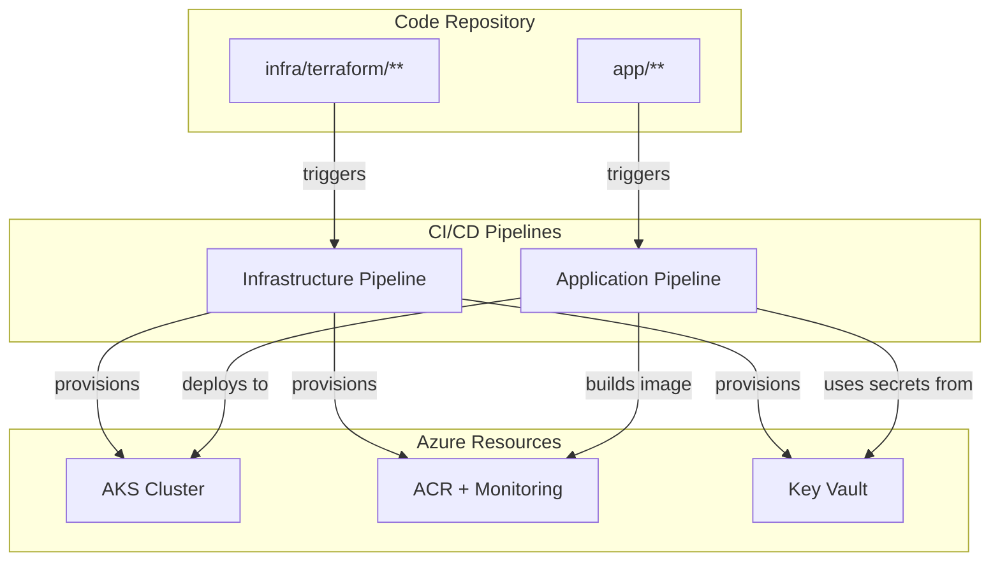
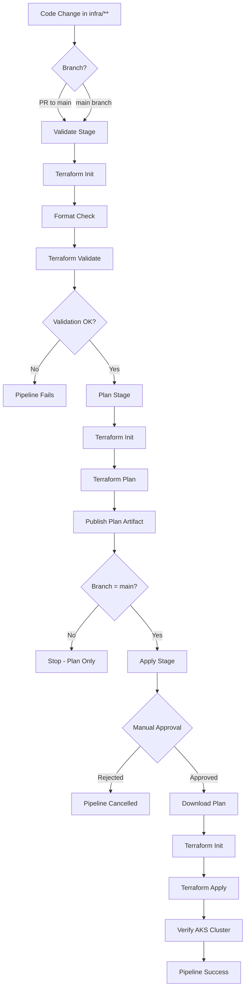
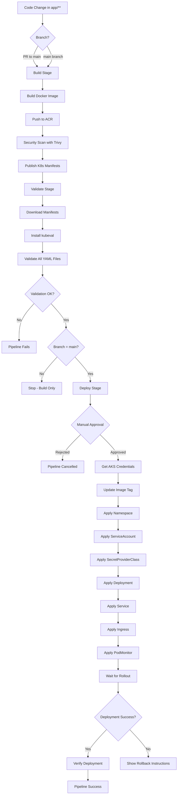
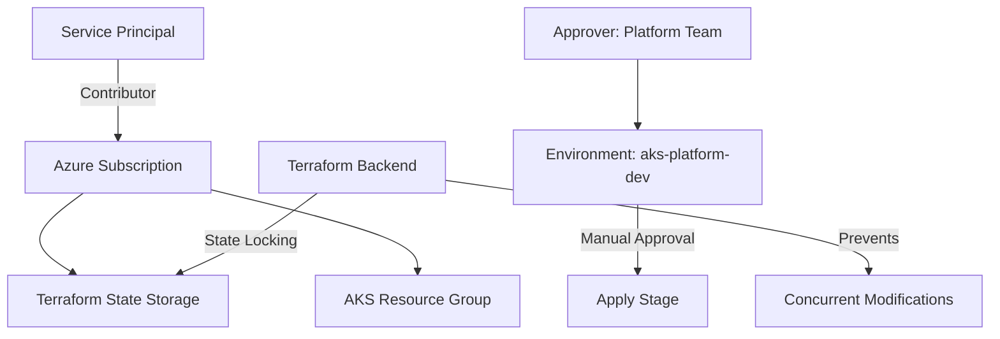
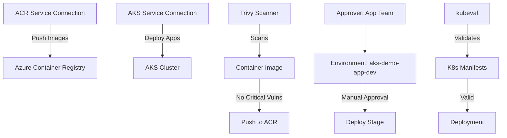
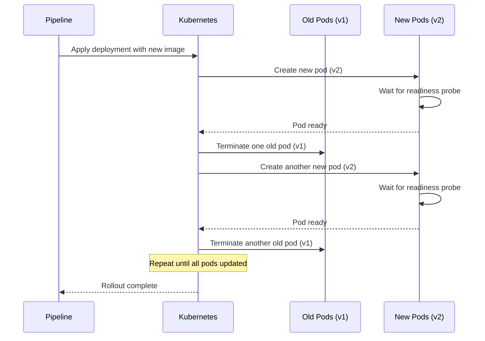
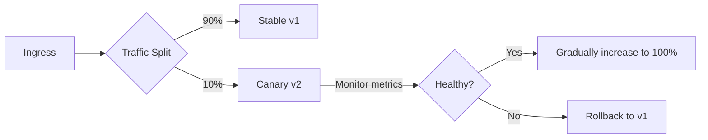
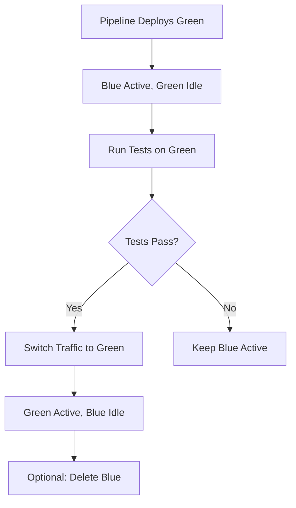
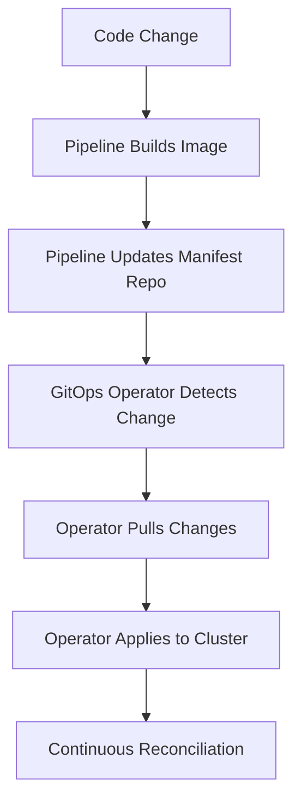

# CI/CD Architecture

This document describes the continuous integration and deployment workflows for the AKS Enterprise Platform.

## Table of Contents

1. [Pipeline Overview](#pipeline-overview)
2. [Infrastructure Pipeline Flow](#infrastructure-pipeline-flow)
3. [Application Pipeline Flow](#application-pipeline-flow)
4. [Security and Approval Gates](#security-and-approval-gates)
5. [Deployment Strategies](#deployment-strategies)

---

## Pipeline Overview

The platform uses two distinct pipelines following the separation of concerns principle:



---

## Infrastructure Pipeline Flow

### High-Level Flow



### Stage Details

#### 1. Validate Stage
**Purpose**: Ensure Terraform code quality before execution

**Steps**:
1. Install Terraform (version 1.5.7)
2. Initialize Terraform backend
3. Check code formatting (`terraform fmt -check -recursive`)
4. Validate configuration (`terraform validate`)

**Outputs**: None (validation only)

**Duration**: ~1-2 minutes

#### 2. Plan Stage
**Purpose**: Generate execution plan and review changes

**Steps**:
1. Install Terraform
2. Initialize backend (connects to Azure Storage)
3. Get current user's Entra ID object ID
4. Generate plan with variables
5. Save plan to file (`tfplan`)
6. Convert plan to readable text
7. Publish plan as artifact

**Artifacts**:
- `terraform-plan`: Binary plan file
- `plan-output`: Human-readable plan

**Duration**: ~2-3 minutes

#### 3. Apply Stage (Conditional)
**Purpose**: Execute Terraform changes in Azure

**Conditions**:
- Only runs on `main` branch
- Requires manual approval via Environment gate

**Steps**:
1. Checkout code
2. Install Terraform
3. Download plan artifact from previous stage
4. Initialize backend
5. Apply plan (`terraform apply -auto-approve tfplan`)
6. Display outputs (cluster name, Grafana URL, etc.)
7. Verify AKS cluster health (`kubectl get nodes`)

**Duration**: ~15-20 minutes (depends on changes)

---

## Application Pipeline Flow

### High-Level Flow



### Stage Details

#### 1. Build Stage
**Purpose**: Build and publish container image

**Steps**:
1. Build Docker image with multi-architecture support (`linux/amd64`)
2. Tag image with:
   - Build ID (e.g., `12345`)
   - `latest` tag
3. Push both tags to Azure Container Registry
4. Run Trivy security scan (HIGH/CRITICAL vulnerabilities)
5. Publish Kubernetes manifests as artifact

**Artifacts**:
- Container images in ACR
- `k8s-manifests`: Deployment files

**Duration**: ~3-5 minutes

#### 2. ValidateManifests Stage
**Purpose**: Validate Kubernetes manifest syntax

**Steps**:
1. Download manifests artifact
2. Install kubeval tool
3. Validate each YAML file against Kubernetes schemas
4. Check for deprecated API versions

**Duration**: ~1 minute

#### 3. DeployDev Stage (Conditional)
**Purpose**: Deploy application to AKS cluster

**Conditions**:
- Only runs on `main` branch
- Requires manual approval via Environment gate

**Steps**:
1. Download manifests artifact
2. Get AKS credentials via Azure CLI
3. Update deployment.yaml with new image tag
4. Apply manifests in order:
   - Namespace
   - ServiceAccount
   - SecretProviderClass
   - Deployment
   - Service
   - Ingress
   - PodMonitor
5. Wait for deployment rollout (5 minute timeout)
6. Verify deployment health
7. Display ingress IP and test commands

**Duration**: ~3-5 minutes

#### 4. RollbackOnFailure Stage (Conditional)
**Purpose**: Provide rollback guidance on deployment failure

**Conditions**:
- Only runs if DeployDev fails

**Steps**:
1. Display manual rollback instructions
2. Show kubectl commands for checking deployment status
3. Provide rollback commands

---

## Security and Approval Gates

### Infrastructure Pipeline Security



**Security Controls**:
- **Service Principal**: Least privilege (Contributor, not Owner)
- **State Locking**: Prevents concurrent Terraform applies
- **Approval Gate**: Manual approval required for Apply stage
- **Plan Review**: Plan artifact published for review before apply
- **Format Check**: Ensures code consistency
- **Validation**: Catches syntax errors before execution

### Application Pipeline Security



**Security Controls**:
- **Image Scanning**: Trivy scans for vulnerabilities (currently warning-only)
- **Manifest Validation**: kubeval prevents invalid Kubernetes resources
- **Approval Gate**: Manual approval required for deployment
- **Least Privilege**: AKS identity has minimal required permissions
- **Secrets Management**: Uses Azure Key Vault via Workload Identity
- **No Hardcoded Secrets**: All credentials via service connections

### Approval Gates Configuration

**Infrastructure Pipeline**:
- **Environment**: `aks-platform-dev`
- **Approvers**: Platform Team Lead, DevOps Lead
- **Timeout**: 7 days (auto-reject after)
- **Required Approvals**: 1

**Application Pipeline**:
- **Environment**: `aks-demo-app-dev`
- **Approvers**: Application Team Lead, On-Call Engineer
- **Timeout**: 2 days
- **Required Approvals**: 1

---

## Deployment Strategies

### Current Strategy: Rolling Update

The platform currently uses Kubernetes Rolling Updates for zero-downtime deployments.



**Configuration**:
```yaml
spec:
  replicas: 2
  strategy:
    type: RollingUpdate
    rollingUpdate:
      maxUnavailable: 0       # Keep all pods available during update
      maxSurge: 1             # Allow 1 extra pod during update
```

**Characteristics**:
- ✅ Zero downtime
- ✅ Gradual rollout
- ✅ Easy rollback
- ⚠️ Both versions run simultaneously during update

### Future Strategies (Not Implemented)

#### Canary Deployment


**Use Case**: High-risk deployments where gradual traffic shift is needed

**Requirements**: Service mesh (Istio, Linkerd) or NGINX Ingress with traffic splitting

#### Blue-Green Deployment


**Use Case**: Instant rollback requirement, database migration testing

**Requirements**: Dual environment slots, load balancer reconfiguration

---

## Pipeline Metrics and Monitoring

### Key Metrics to Track

| Metric | Target | Importance |
|--------|--------|------------|
| Infrastructure pipeline duration | < 25 min | Developer productivity |
| Application pipeline duration | < 10 min | Deployment frequency |
| Deployment success rate | > 95% | Reliability |
| Time to rollback | < 5 min | Incident recovery |
| Failed deployments per week | < 2 | Quality |
| Terraform plan changes | Review all | Change awareness |

### Pipeline Dashboards

Monitor pipeline health in Azure DevOps:
- **Analytics → Pipeline Analytics**: Success rate, duration trends
- **Pipeline → Runs**: Recent execution history
- **Environments → Deployments**: Deployment history per environment

### Alerts to Configure

1. **Pipeline Failure**:
   - Trigger: Any pipeline run fails
   - Action: Notify team channel

2. **Long-Running Pipeline**:
   - Trigger: Infrastructure pipeline > 30 min
   - Action: Investigate performance

3. **Pending Approval**:
   - Trigger: Approval waiting > 4 hours
   - Action: Notify approvers

4. **Deployment Rollback**:
   - Trigger: `kubectl rollout undo` executed
   - Action: Create incident ticket

---

## Integration with GitOps (Future Enhancement)

### Current State: Push-Based Deployment
Pipelines directly apply changes to cluster using `kubectl`.

### Future State: Pull-Based GitOps



**Benefits**:
- Cluster state declarative in Git
- Automatic drift correction
- Better audit trail
- Multi-cluster support

**Tools to Consider**:
- **Flux CD**: Lightweight, native Kubernetes
- **Argo CD**: Full-featured UI, ApplicationSets
- **Azure Arc GitOps**: Azure-native, multi-cluster

---

## Troubleshooting Common Pipeline Issues

### Infrastructure Pipeline

| Issue | Cause | Solution |
|-------|-------|----------|
| State lock timeout | Concurrent apply running | Break lock after confirming no active applies |
| Plan shows unexpected changes | Manual changes in Azure | Import resources or revert manual changes |
| Format check fails | Unformatted code | Run `terraform fmt -recursive` locally |
| Validate fails | Syntax error | Fix error shown in output |
| Apply timeout | Large infrastructure change | Increase timeout or split changes |

### Application Pipeline

| Issue | Cause | Solution |
|-------|-------|----------|
| Image build fails | Dockerfile error | Test build locally with Docker |
| Trivy scan fails | Critical vulnerabilities | Update base image or dependencies |
| kubeval fails | Invalid manifest | Fix manifest syntax errors |
| Deployment timeout | Pod not starting | Check pod logs and events |
| Rollout stuck | Readiness probe failing | Review probe configuration |
| Image pull error | ACR authentication | Verify AcrPull role assignment |

---

## References

- [Azure DevOps Pipelines](https://learn.microsoft.com/azure/devops/pipelines/)
- [Terraform in CI/CD](https://developer.hashicorp.com/terraform/tutorials/automation/automate-terraform)
- [Kubernetes Deployment Strategies](https://kubernetes.io/docs/concepts/workloads/controllers/deployment/)
- [GitOps Principles](https://opengitops.dev/)

---

**Last Updated**: 2026-03-10
